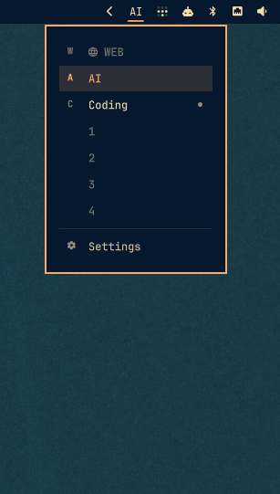
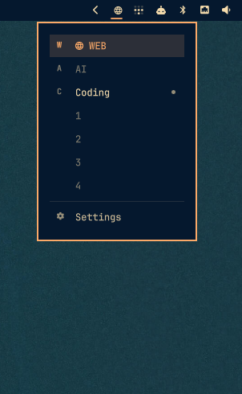
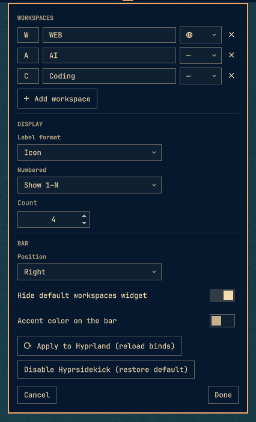

# Hyprsidekick

An [Omarchy](https://omarchy.org/) bar widget for **mnemonic named workspaces** —
AeroSpace-style (the macOS tiling window manager) adapted to Hyprland. Shows the
workspace you're on as a pill, opens a dropdown of all your workspaces (named +
numbered) to click-jump, and gives you a visual Settings panel to manage them and
their Hyprland keybinds — no JSON editing required.

> Replaces the stock `omarchy.workspaces` widget, which only shows numeric
> workspaces and hides named ones.

<p align="center">
  
  &nbsp;&nbsp;
  
  &nbsp;&nbsp;
  
</p>

## How it works

You give each workspace a one-letter **mnemonic** and a **name** (and, optionally,
an **icon**). Hyprsidekick then:

- binds **`ALT + <letter>`** to jump to that workspace, and **`ALT + SHIFT + <letter>`**
  to send the focused window there, and
- shows the workspace you're currently on as a **pill** in the bar — by name,
  letter, `letter·name`, or icon (your choice).

**Example:** a workspace with key `C` and name `Coding` →

- **`ALT + C`** jumps to it (on a Mac-style keyboard remapped with keyd, your
  `Option`/`Cmd` key acts as `ALT`, so it's **`Cmd + C`**),
- the bar pill reads `C·Coding` (or `Coding`, or `C`, or its icon 󰅩).

So instead of remembering "workspace 4", you press the letter that means something
to you. Click the pill to see them all and jump with the mouse.

### Reading the dropdown

- **Highlighted** row = the workspace you're on now.
- **Dot** on the right = that workspace has open windows (occupied); no dot /
  dimmed = empty.
- **Named** mnemonics are listed first, then your **numbered** workspaces.
- **Settings** (gear, bottom) opens the visual editor.

## Features

- **Pill** showing the active workspace — by mnemonic, name, `key·name`, or icon.
- **Dropdown** of every workspace (named mnemonics + numbered), with the active
  one highlighted and an occupied dot; click a row to jump.
- **Settings panel** (in-shell, no config files): add / remove / edit workspaces
  (key, name, icon picker), choose label format and numbered-workspace behavior,
  move the widget between bar sections, and hide the stock widget.
- **Hyprland integration**: generates `~/.config/hypr/hyprsidekick.lua` with the
  `ALT+<key>` switch / `ALT+SHIFT+<key>` move binds for your workspaces and
  reloads Hyprland — one click.
- Live preview while editing; **Cancel** (or Escape / click-away) reverts,
  **Done** commits.
- **Durable config**: your workspaces persist to `~/.config/hyprsidekick/config.json`,
  so disabling/re-enabling or updating the plugin never loses them.

## Install

```bash
omarchy plugin add https://github.com/kconfesor/hyprsidekick.git --enable
omarchy bar move kconfesor.hyprsidekick --section left
```

Open the widget's **Settings** (dropdown → gear), set up your workspaces, and hit
**Done**. Whenever you add/remove a workspace or change its key or name,
Hyprsidekick regenerates the `ALT+<key>` binds and reloads Hyprland
automatically — and installs the `require("hypr.hyprsidekick")` line into
`~/.config/hypr/bindings.lua` for you the first time. (A manual **Apply to
Hyprland** button is there too, to force a re-apply.)

> Plugins run **unsandboxed**. Review the source before enabling.

## Usage

- **Left-click the pill** → open the dropdown. Click any workspace to jump to it
  (empty numbered workspaces are created on click).
- **Dropdown footer → Settings** → open the editor.
- `ALT + <key>` switches to a workspace, `ALT + SHIFT + <key>` moves the focused
  window there (binds update automatically when you edit workspaces). On a
  keyboard remapped with keyd, your `Option`/`Cmd` key is `ALT`.

## Configure

Everything is editable in the **Settings** panel (its footer's gear). It persists
to `~/.config/hyprsidekick/config.json` (the durable source of truth) and mirrors
into the widget's entry in `~/.config/omarchy/shell.json`:

| Key | Values | Default | Meaning |
|-----|--------|---------|---------|
| `workspaces` | `[{ "key", "name", "icon" }]` | — | Your named workspaces + mnemonics. |
| `labelFormat` | `key` · `name` · `key-name` · `icon` | `key-name` | How the pill renders the active workspace. |
| `numberedMode` | `range` · `active` · `hidden` | `active` | Numbered workspaces in the dropdown: fixed 1..N, only active, or none. |
| `numberedCount` | integer | `9` | N, when `numberedMode` is `range`. |
| `hideStockWidget` | bool | `true` | Remove the stock `omarchy.workspaces` from the bar. |
| `barSection` | `left` · `center` · `right` | `left` | Which bar section the widget sits in. |

**Placement**: use the Settings **Position** selector, or
`omarchy bar move kconfesor.hyprsidekick --section <left|center|right>`.

## Remove

```bash
omarchy plugin remove kconfesor.hyprsidekick
omarchy plugin enable omarchy.workspaces   # restore the stock widget
```

Then remove the `require("hypr.hyprsidekick")` line from
`~/.config/hypr/bindings.lua`, and delete `~/.config/hypr/hyprsidekick.lua` (the
generated binds) and `~/.config/hyprsidekick/` (the saved config) if you no longer
want them.

## License

MIT © Kelvin Confesor
